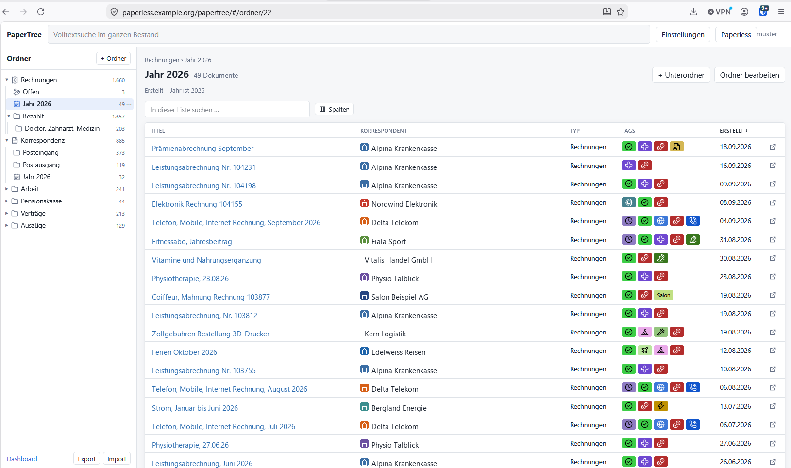

# PaperTree

A read-only navigation and reading layer on top of Paperless-ngx. Views live
as a tree inside PaperTree; Paperless stays the source of truth for the
documents themselves.

Status: **stages 1 and 2 implemented** (version 0.4.0). The requirements live
in the document "PaperTree – Anforderungen"; the markers A1–A7, F1–F9 and
N1–N6 in the source files refer to it.

*Deutsche Fassung: [README.de.md](README.de.md). The interface itself speaks
five languages; the code, comments and command-line flags are German.*



*More: [screenshots in the wiki](https://github.com/sommer79/papertree/wiki/Screenshots).
Names, correspondents and documents in the pictures are invented.*

## What PaperTree does

- A folder tree, nested as deep as you like, with two switches per folder —
  **own filter** and **include subfolders**. Between them they give all four
  display modes, including pure navigation
- Moving and sorting folders: drag and drop on the desktop (line above or
  below = sibling, outline = child, empty space = top level), and on a phone
  through the folder menu and the "parent folder" field
- **Dynamic subfolders**: a folder can derive its children from the values
  that actually occur — by year, correspondent, document type, tag, storage
  path or a custom field. When a new value shows up, the subfolder appears by
  itself. Hand-made subfolders continue to exist alongside them
- **Tabs inside a folder**: a subfolder can appear as a tab of its parent
  instead of a line in the tree — same filters, same inheritance, just
  shown where you are working. Each tab carries its document count
- **Export and import of the tree** as JSON
- Filter inheritance along the tree, switchable per folder; the effective
  filter is visible in the editor
- Aggregation across subfolders. This is how PaperTree manages an OR across
  different criteria, which the Paperless API cannot express in a single query
- A view editor built from the metadata of Paperless itself: tags,
  correspondents, document types, storage paths, date fields and custom
  fields with the operators of their data type. Live match count included
- Adopting a filter from a copied Paperless link
- Document list with selectable columns, sorting and paging; tile view.
  Title and correspondent share one column, with the correspondent's logo
  in front of them; sorting happens in a field above the list and offers
  what the visible columns allow. A click on a tag narrows the list to it —
  the filter lives in the URL, so it can be shared and leaves the stored
  folder alone
- **An icon per folder**, chosen from some two thousand, searchable by
  topic in the language of the interface
- Detail view with a built-in PDF viewer, download and an "open in Paperless"
  button
- Full-text search, globally and within a folder
- A start page with the folders you want on it — drag the cards into the
  order you like — and, below them, the newest documents across everything:
  searchable, sortable, with selectable columns
- **Settings for administrators**: an icon per tag, which replaces the
  shortened name in the lists, and a logo per correspondent, shown small
  in front of the name and large in the corner of the document view. Both
  apply in PaperTree only; nothing changes in Paperless
- Five languages – German, English, French, Italian and Spanish – taken
  from the user's own Paperless settings, with English for anything else.
  Dates follow the date locale set there, always in the medium form
- Usable on a phone

Deliberately absent: any change to Paperless data, showing which other
folders a document also appears in (N5), and publishing a folder as a
Paperless view (O1, not decided yet).

## Principles anchored in the code

**Read-only (A1).** `app/paperless.py` is the only place that reaches
Paperless. It sends nothing but GET and checks every path against a
whitelist. A bug in the interface cannot change anything in Paperless.

**The login belongs to the user (A2).** PaperTree holds no token; it passes
the session cookie through. Anyone not logged into Paperless sees nothing,
and the Paperless permissions apply unchanged. This is why PaperTree has to
run under the same domain.

**No copy of the documents (A3).** Preview and download are streamed through.
The only thing cached is the order of the document IDs, per user and sort
order, for 60 seconds.

**Filters are query parameters (A4).** PaperTree does not reimplement the
rule types of Paperless. A new filter in Paperless therefore works
immediately.

**One tree per user (A7).** Every database query names the user ID.

**One place for the language.** PaperTree has no language setting of its
own: it speaks the language chosen in Paperless, and writes dates with the
date locale set there. Two settings for the same thing drift apart, and
nobody looks for them in two places. A language PaperTree does not have
gets English.

**A tab is a folder.** A subfolder marked as a tab disappears from the tree
and shows up as a tab of its parent instead. Nothing else changes: it keeps
its filter, inherits like any other subfolder, and counts towards "include
subfolders". Only where it is shown is different — which is why it is a flag
on the node and not a second kind of thing.

**Appearance is shared, the tree is not.** Tag icons and correspondent
logos look the same for everyone and are maintained by an administrator;
the server checks that, the interface merely hides what would be refused
anyway. An uploaded logo is checked by its magic bytes rather than its
file name, and an SVG carrying a script is rejected — it would otherwise
run in the browser of every colleague.

## Layout

```
app/filters.py      Allowed parameters, merging filter sets, link import
app/tree.py         Nodes, inheritance, query plans, reference checks
app/groups.py       Dynamic subfolders: finding values, group as a filter set
app/documents.py    Executing plans: directly or via document IDs
app/paperless.py    The read-only access - whitelist and cookie pass-through
app/sprache.py      Which language and date format Paperless reports
app/logos.py        Correspondent logos: type check, storage, SVG defence
app/db.py           SQLite: the tree, tag icons, logo assignments
app/main.py         HTTP interface and serving
web/                Interface, ES modules without a build chain
web/sprachen/       One catalogue per language, plain JSON
tests/              78 checks, without Paperless and without a network
```

A dynamic group is, in the end, just another filter set. That is why
inheritance, aggregation, sorting and search inside the folder keep working
on it unchanged — and a check makes sure that every generated group filter
names only parameters Paperless knows.

### Why layers

Inheritance combines filter sets with AND. That cannot always be expressed in
a single set: "has one of the tags A or B" AND "has one of the tags C or D"
is not a single `tags__id__in`. So `filters.verschmelzen` merges what can be
merged — the common case, one query — and leaves the rest standing as its own
layer. Several layers mean PaperTree fetches the document IDs per layer and
intersects them. The union across subfolders works the same way.

## Running it

You need a running Paperless-ngx in Docker.

```bash
git clone https://github.com/sommer79/papertree.git
cd papertree
./deploy/install.sh
```

That is all — the installer walks through both halves of the setup:

**1. The container.** It works out what it needs: the Paperless container
(recognised by its image, not its name), that container's Docker network, the
internal and the public address, and a free port. What it found is offered as
the default in every prompt, Enter accepts it, and every value can be
overridden. Nothing is written until you confirm, and then only to
`deploy/.env`; the compose file itself stays untouched. After that it builds
and starts the container and checks not only whether PaperTree answers, but
whether it can reach Paperless.

**2. The reverse proxy.** PaperTree deliberately listens on `127.0.0.1` only,
and it has to be served under **the same address as Paperless** — only then
does the Paperless session cookie apply, and without it nobody is logged in.
If the installer finds nginx, it offers to insert the necessary block itself:
with a backup, a following `nginx -t`, and a reload. If nginx objects to the
file, the backup is restored rather than leaving a broken configuration in
place.

With a different reverse proxy — Apache, Caddy, Traefik — it tells you what
to set up: route the path `/papertree/` to `http://127.0.0.1:<port>/`,
unbuffered, so that the PDF preview arrives as a stream.
`deploy/nginx-papertree.conf` serves as the template.

To look without changing anything:

```bash
./deploy/install.sh --pruefen
```

The nginx step can also be done on its own afterwards:

```bash
sudo python3 deploy/nginx_einfuegen.py \
     --host paperless.example.org --pfad papertree --port 8080 --neuladen
```

### Settings

| Variable | Default | Meaning |
| --- | --- | --- |
| `PAPERTREE_PAPERLESS_URL` | `http://localhost:8000` | where PaperTree reaches Paperless internally |
| `PAPERTREE_PAPERLESS_PUBLIC_URL` | empty | how Paperless is reachable for the browser |
| `PAPERTREE_BASE_PATH` | `papertree` | the nginx path |
| `PAPERLESS_NETZ` | `paperless_default` | Docker network of the Paperless stack |
| `PAPERTREE_PORT` | `8080` | port on `127.0.0.1` |
| `PAPERTREE_DB` | `/data/papertree.sqlite3` | the database holding the tree |
| `PAPERTREE_LOGO_DIR` | next to the database | where correspondent logos are stored |
| `PAPERTREE_LOGO_MAX_BYTES` | `1048576` | size limit per logo |
| `PAPERTREE_INDEX_TTL` | `60` | seconds the cached ID order stays valid |
| `PAPERTREE_TIMEOUT` | `30` | time limit for one request to Paperless |

### Data and backup

Everything PaperTree owns lives in the volume `papertree_daten`:

- `papertree.sqlite3` – folder tree, tag icons, logo assignments
- `logos/` – the uploaded image files

The volume name is fixed in the compose file and does not depend on the
project name. Without that fixed name Compose would prepend the project name,
which comes from the directory of the compose file — started from a different
folder, a second, empty volume would appear and the folder tree would seem to
be gone.

Backups are made with `deploy/papertree-sichern.sh`. The script takes a
self-consistent copy of the database — through the online backup interface of
SQLite, because a plain file copy might be incomplete in WAL mode — and packs
it together with the logos into an archive:

```bash
sudo install -m 755 deploy/papertree-sichern.sh /usr/local/sbin/papertree-sichern
papertree-sichern /path/to/backup/folder
```

If you already back Paperless up through systemd, attach PaperTree to the
same service with a drop-in instead of maintaining a timer of your own:

```ini
# /etc/systemd/system/<service>.service.d/papertree.conf
[Service]
ExecStart=/usr/local/sbin/papertree-sichern
```

With `Type=oneshot`, systemd runs several `ExecStart` lines one after
another.

**Important:** a backup of Paperless does not cover this data. The folder
tree exists here and nowhere else.

## Development

```bash
python -m venv .venv
.venv/Scripts/python -m pip install -r requirements.txt
python -m unittest discover -s tests
```

The tests run without Paperless: `tests/test_kern.py` checks the filter model
and the tree logic, `tests/test_ausfuehrung.py` the merging via IDs against a
stub, and `tests/test_sprachen.py` that every key the interface asks for
exists in all five languages, with the same placeholders.

### Adding a language

1. Copy `web/sprachen/en.json` to `<code>.json` and translate the values. The
   keys stay as they are — they are the contract with the code.
2. Add the code to `SPRACHEN` in `web/js/sprache.js` and in `app/sprache.py`.
3. Run the tests. They fail with a list of what is still missing.

The `thema.*.woerter` entries are search keywords for the icon picker, not
translations: use the words somebody would actually type in that language.
A theme is found through its name or any of its keywords.

## Assumptions made about Paperless 3.1.3

Read out of the installation, not guessed:

- 104 filter parameters from `DocumentFilterSet`
- Sort fields from `DocumentViewSet.ordering_fields`, plus
  `custom_field_<id>`
- `custom_field_query` understands `AND`, `OR` and `NOT`, at most ten levels
  deep and twenty conditions
- Operators per custom field type from
  `CustomFieldQueryParser.EXPR_BY_CATEGORY`
- `fields=id` is supported, `max_page_size` is 100000
- `ui_settings` reports who is signed in, whether they are a superuser, the
  display language as `settings.language`, and the date locale nested in
  `settings.date_display.date_locale` — not under the flat name the frontend
  uses. That locale can carry the special value `iso-8601`, which is a
  notation rather than a language
- Full-text search runs on Tantivy and knows `query`, `text`, `title_search`
  and `more_like_id`. Paperless allows exactly one of them per request but
  applies the remaining filters beforehand — `filters.verschmelzen` sticks to
  that

## License

Apache License 2.0, see [LICENSE](LICENSE). It permits use, modification and
redistribution, commercially as well, and includes an express patent licence.

PaperTree talks to Paperless-ngx through its HTTP interface only and embeds
no code from it. The GPL of Paperless therefore does not extend to this
project.

The bundled libraries under `web/vendor/` keep their own licences; which
ones they are and where the texts live is recorded in [NOTICE](NOTICE) and in
[web/vendor/HERKUNFT.md](web/vendor/HERKUNFT.md).
